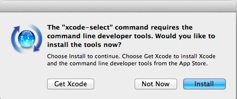
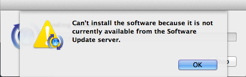
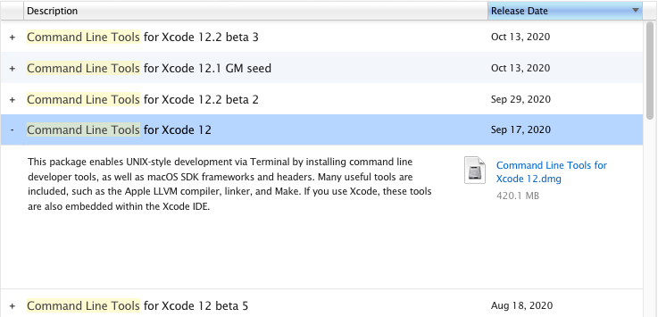

Here you can find the steps to set up your computer for FCB. Depending
on the operating system of your computer, you may have to follow different
steps. Here, you will find those steps separately for Unix, Windows and macOS
when necessary. It is recommended that you install the software tools in the
order given here.

* [**Unix shell**](#unix-shell)
* [**Git version-control system**](#git-version-control-system)
* [**Text editor**](#text-editor)
* [**Python and Jupyter Notebook**](#python-and-jupyter-notebook)
* [**Python modules**](#python-modules)
* [**R and RStudio**](#r-and-rstudio)

If you have a tablet device, then it is probably running either Android
(Samsung Galaxy Tab, etc.) or iOS (iPad). You will also find below instructions
for such devices but at some point it may become easier for you to work
with a computer. In any case, it is recommended that you use some external
keyboard with your tablet.

**Very important:** whenever you find below instructions that ask you to
type some commands starting with a dollar sign (`$`), such as:

```
$ some command to type
```
You should **NOT** type the starting dollar sign (`$`), because it is just a convention,
called the
[command prompt](https://en.wikipedia.org/wiki/command-line_interface#command_prompt),
to indicate that you should write the given commands in the
[Unix shell](https://en.wikipedia.org/wiki/Unix_shell) running within
the [terminal window](https://en.wikipedia.org/wiki/Terminal_emulator) application.

## Unix shell

### Unix

If you have a computer running some flavor of the Unix operating system, such
as [Ubuntu](https://ubuntu.com), [RedHat](https://redhat.com) or
[CentOS](https://www.centos.org), you don't need to do anything because you're
alredy have direct access to the Unix shell through the terminal window.

### Windows

If you have a computer running the Windows operating system, then you can
install [GitForWindows](https://gitforwindows.org/), which will provide you a
Unix shell within Windows through its tool _Git Bash_.

The _Git Bash_ application will open a terminal window that should look similar
to this one below.

  

If we are running the _Git Bash_ terminal application in a Windows system with
a Spanish or Catalan regional configuration, we may encountar that the Unix
`sort` command doesn't provide a correct numerical order for numbers with
decimal digits when those are stored in text files using dots as decimal
separators. To fix that we should switch that regional configuration in the
_Git Bash_ application by clicking on the _Git Bash_ logo at the top-left
of its window and select `Options...`. A popup window should appear similar
to this one below.

  

In this popup window, we should first click on the section called `Text` from
the left panel. Then, we should click on the pull-down menu called `Locale`
and select the option `C`. Finally, we should click on `Apply`, then `Save`,
close the _Git Bash_ application and next time we open it again, it will work
with a regional configuration in which the dot (`.`) will now work as decimal
separator character.

### macOS

If you have an [Apple](https://apple.com) computer running the macOS operating
system, then you already have a Unix shell available through the
[Terminal app](https://www.dummies.com/computers/macs/mac-operating-systems/unix-terminal-application-on-your-macbook). However, you still need two more software components
to facilitate working and installing additional software from the command line:

  1. [Xcode Command-Line Tools (CLT)](https://developer.apple.com/xcode/features).
     Open the Terminal app and type the following instruction:
     ```
     $ xcode-select --install
     ```
     Do not misinterpret this step as installing the _whole_ of Xcode, which is the MacOS suite of
     developer tools and in any case **do not** attempt to install the _whole_ of Xcode,
     because we do not need it for this course. You may be getting a popup window like
     this one here below.

     

     In such a case, press the default `Install` button.

     **If** you get an error about not
     being able to install the software because it is not currently available from the
     _Software Update Server_ in another popup window similar to this one here below.

     

     Then, you should go to the Apple developer site with your Apple user credentials,
     by following this link:

     [https://developer.apple.com/download/more/?=command%20line%20tools](https://developer.apple.com/download/more/?=command%20line%20tools)

     Click on "Command Line Tools for Xcode _version_", where _version_ should be the
     latest _non-beta_ version, and you will see a pull-down menu similar to the one here below.

     

     Click and download the `.dmg` file link. This is an _Apple installer_ file that,
     once opened, it should install the Xcode CLT software in your system.

  2. [Homebrew](https://brew.sh). Type the following instruction in the terminal window:
     ```
     $ /bin/bash -c "$(curl -fsSL https://raw.githubusercontent.com/Homebrew/install/master/install.sh)"
     ```
     Pay attention to the fact the installation process may ask you to confirm to
     proceed by pressing the `Enter` key and eventually type your user password as well.
     Once the installation has finished, you can check whether it has been successful by
     typing the following command:
     ```
     $ brew doctor
     Your system is ready to brew.
     ```
     If you get the previous output message, you are ready to use Homebrew.

### Android

If you have a tablet running Android, then you already have a Unix system
but you still need a terminal emulator app. There are a few options, but
probably the best one for our goals here is
[Termux](https://play.google.com/store/apps/details?id=com.termux). You
can find further details on how to install and use Termux in Android
in the following
[link](https://www.techrepublic.com/article/how-to-get-a-linux-terminal-on-android).

### iOS

If you have a tablet running iOS, then you already have a Unix system but
you still need a terminal emulator app. There are a few options, but
probably the best one for our goals here is
[iSH](https://ish.app).

## Git version-control system

### Unix

If you have a computer running some flavor of the Unix operating system, such
as [Ubuntu](https://ubuntu.com), [RedHat](https://redhat.com) or
[CentOS](https://www.centos.org), probably the git version-control system is
already installed. Check it out by opening a terminal window and typing the
following in the shell:

```
$ which git
```

If typing the previous instruction gives no answer, then the git version-control
software is not installed in your Unix system. To install it go to the
following [page](https://git-scm.com/download/linux) and follow the instructions,
according to the Unix distribution you have in your computer.

### Windows

If you have a computer running the Windows operating system, then you can
install [GitForWindows](https://gitforwindows.org/), which will provide you
the git version-control system. If you already installed it before to have
the Unix shell, then you don't need to do anything else.

### macOS

If you successfully installed the X-code CLT, then you should already have Git
install in your macOS system. You can check that out by typing in the shell
of the terminal window:

```
$ which git
/usr/bin/git
```

If you get an error, then go to the previous section and install the
Xcode CLT.

### Android

If you have a tablet running Android, once you have installed the
Termux app (see previous section), open the terminal window and
type:

```
$ apt update
$ apt upgrade
```
If both commands execute successfully, then you can type the final
command that will install Git and other component called `openssh`, which is
also necessary for Git.

```
apt install git openssh
```
Once this installation is finished, you should type:

```
$ termux-setup-storage
```
This command will probably cause Android to ask you to allow
the app to access storage. You should grant that access. You
can find more details on the installation of Git in an Android
device in this
[link](https://www.techrepublic.com/article/how-to-install-git-on-android).

### iOS

If you have a tablet running iOS, once you have installed the
[iSH](https://ish.spp) app (see previous section), open the terminal window and
type:

```
$ apk add git
```

## Text editor

We need a text editor to edit scripts and programs. The
[Microsoft Notepad](https://en.wikipedia.org/wiki/Microsoft_Notepad) is a text editor but
[Microsoft Word](https://en.wikipedia.org/wiki/Microsoft_Word) or
[Apple Pages](https://en.wikipedia.org/wiki/Pages_%28word_processor%29) are not. For
scripting and programming is always best to use an editor with
[syntax highlighting](https://en.wikipedia.org/wiki/Syntax_highlighting) (Notepad has
no syntax highlighting). The specific editor you may want to use depends on what
editor you feel most comfortable working with. The available options can be splitted
into two types of editors: classical and modern ones. Classical text editors can work
in text mode only, i.e., you can use them remotely through a text connection, but
modern editors are easier to use for newbies:

* Classical text editors (available in nearly every Unix system):
  * [nano](https://www.nano-editor.org)
  * [emacs](https://www.gnu.org/software/emacs)
  * [vim](https://www.vim.org)

* Modern text editors with a graphical interface:
  * [sublime](https://www.sublimetext.com)
  * [atom](https://atom.io)

If you want to use a classical editor in a **macOS system**, check out first whether
is already available in the shell via `which nameofeditor` and if not, use
Homebrew to install it via `brew install nameofeditor`, where you should
**replace** `nameofeditor` **by the name of the editor application**.

## Python and Jupyter Notebook

There are two major versions of Python, 2.x and 3.x, and they are not
[compatible](https://en.wikipedia.org/wiki/History_of_Python). Because Python 2.x
is no longer maintained and progressively more code is being developed for Python 3.x,
it is recommended that you install Python 3.x in your computer.

### Unix

If you have a computer running some flavor of the Unix operating system, such
as [Ubuntu](https://ubuntu.com), [RedHat](https://redhat.com) or
[CentOS](https://www.centos.org), probably Python 3.x is already installed.
Check it out by opening a terminal window and typing the following in the shell:

```
$ which python3
```
If typing the previous instruction gives no answer, then the Python 3.x
software is not installed in your Unix system. The specific package manager software
that you can use to install Python 3.x depends on your specific Unix distribution.
You can find instructions for different distributions in the following
[link](https://realpython.com/installing-python/#how-to-install-python-on-linux).

Once Python 3.x is installed, you can install Jupyter Notebook by typing:

```
$ pip install jupyter
```

### Windows

If you have a computer running the Windows operating system, then you should
follow these steps:

  1. Go to the [Python downloads for windows](https://www.python.org/downloads/windows)
  page, follow the link for the _Latest Python 3 Release_ and in the next page scroll
  down until you find the link to download the _latest stable Windows x86-64 executable_.
  If your system has a 32-bit processor, then you should look for the link of the
  32-bit installer. Follow that link and once the download has finished, execute the
  installer program you have just downloaded.
  2. During the installation, select the option _Add Python to PATH_ and use all
  the other default options.
  3. To check whether the Python 3.x installation was successful open the Git Bash
  terminal window and type:
  ```
  python3 --version
  ``` 

In some versions of Windows, after following the previous steps, you may encounter
the following error:


In such as case you need to find the control panel for managing app execution aliases
and switch off the aliases for `python.exe` and `python3.exe`, as shown in the captured
images below. A quick way to find that control panel is by typing `manage app execution
aliases` into the Windows search prompt.

<div class="sbys-row">
  <div class="sbys-column">
    
  </div>
  <div class="sbys-column">
    
  </div>
  <div class="sbys-column">
    
  </div>
</div>

Restart the Git Bash terminal window and try again:

```
$ python3 --version
```

### macOS

If you have an [Apple](https://apple.com) computer running the macOS operating
system, then you have by default a system-wide installation of Python 2.x. You
can check that by opening the
[Terminal app](https://www.dummies.com/computers/macs/mac-operating-systems/unix-terminal-application-on-your-macbook) and typing the following:

```
$ which python
/usr/bin/python
$ python --version
Python 2.7.16
```

The lines without an starting dollar sign (`$`) indicate the output you should
be seeing in your terminal window. It may happen that the last line gives a 2.x.y
version but with a different minor (`x`) or revision (`y`) version numbers than the
ones shown here.

Installing and maintaining a Python installation in macOS may become complicated,
see this [xkcd joke](https://xkcd.com/1987). For
this reason, it is recommended to use a package manager software such as Homebrew
to install Python 3.x and Jupyter Notebook, through the following two steps:

  1. Install Python3 using Homebrew as follows:
     ``` $ brew install python3
     ```
     You can check whether the installation has been successful by typing
     ```
     $ which python3
     /usr/local/bin/python3
     $ python3 --version
     Python 3.8.5
     ```
     Again, it may happen that the last line gives a 3.x.y version but with a
     different minor (`x`) or revision (`y`) version numbers than the ones shown here.
  4. Install Jupyter Notebook using Homebrew as follows:
     ```
     brew install jupyterlab
     ```
     You can check whether the installation has been successful by typing
     ```
     $ which jupyter
     /usr/local/bin/jupyter
     ```

## Python modules

To install additional modules in Python, such as `numpy`, `pandas` or `matplotlib`,
you can use the `pip` tool as follows:

```
$ pip install <modulename>
```
where you should replace `<modulename>` by the name of the module you want to install
(e.g., `numpy`, `pandas` or `matplotlib`). Note that if you installation of Python
version 3.x is available in your system through the executable `python3`, then you
will have to use also the `pip3` tool, by doing:

```
$ pip3 install <modulename>
```

If you are on **Windows**, using the _Git Bash_ Unix shell, you may encounter the
error below when using the `pip` or `pip3` tool.


In such a case, first install the `pipwin` module as follows:

```
$ python -m pip install pipwin
```
Second, install every other module as follows:

```
$ python -m pipwin install <modulename>
```
where you should replace `<modulename>` by the name of the module you want to install
(e.g., `numpy`, `pandas` or `matplotlib`). Remember to replace `python` by `python3`
in the previous instruction if your Python version 3.x installation is available through
the `python3` executable.


## R and RStudio

To install R and RStudio you must first install R and then RStudio.

### Unix

To install R in a Unix (Linux) OS, go to
[https://cran.r-project.org](https://cran.r-project.org),
follow the link "[Download R for Linux](https://cran.r-project.org/bin/linux)", select
the linux distribution and follow the given instructions. If you get a list of files,
follow the link of the file called `README.html` to obtain the instructions.

To install RStudio in a Unix (Linux) OS, go to
[https://rstudio.com/products/rstudio/download](https://rstudio.com/products/rstudio/download),
select the download link under _RStudio Desktop (Free)_, and finally download the
installer file for your Linux distribution and install it according to the corresponding
package manager. For instance, in the case of a Debian/Ubuntu distribution, once the
`.deb` file is downloaded, you should be able to install it in your system by typing
the following on the Unix shell:

```
$ sudo dpkg -i rstudio-x.y.z-arch.deb
```
where `x.y.z` refer to the RStudio version and `arch` to the processor architecture
(`x86_64` or `amd64`).

### Windows

To install R in a Windows OS, go to
[https://cran.r-project.org](https://cran.r-project.org),
follow the links "[Download R for Windows](https://cran.r-project.org/bin/windows)",
and in the next page
"[install R for the first time](https://cran.r-project.org/bin/windows/base)".
Finally, follow the instructions in the loaded page, which essentially consist
of downloading an installer program (a `.exe` file) and executing it in your
computer to install R. **If you want** to be able to use R from the Unix command
line, using a [text editor](#text-editor) you should create a new file called
`.bashrc` in your _home_ directory and add the following line:

```
$ export PATH="/c/Program Files/R/R-4.0.3/bin":$PATH
```
where you should replace the added path `/c/Program Files/R/R-4.0.3/bin` by the path
in the filesystem where the R executables have been stored. If the file `.bashrc`
already existed, open it in the [text editor](#text-editor) and add the previous line
to the bottom of the file. Once you have created or updated this file `.bashrc`, you
need to exit the current Git Bash terminal window and start a new one. In this new
terminal window you should then be able to see that the `R` executable is available
by typing:

```
$ which R
```

To install RStudio in a Windows OS, go to
[https://rstudio.com/products/rstudio/download](https://rstudio.com/products/rstudio/download),
select the download link under _RStudio Desktop (Free)_, and finally download and run the
installer file (`RStudio-x.y.z.exe`) for Windows.

### macOS

To install R in macOS, go to
[https://cran.r-project.org](https://cran.r-project.org),
follow the link "[Download R for (Mac) OS X](https://cran.r-project.org/bin/macosx)" and
download the `.pkg` installer file for the latest release of R.

To install RStudio in macOS, go to
[https://rstudio.com/products/rstudio/download](https://rstudio.com/products/rstudio/download),
select the download link under _RStudio Desktop (Free)_, and finally download and run the
installer file (`RStudio-x.y.z.dmg`) for macOS.

### Android

To install R in an Android device you need first to install
[Termux](https://play.google.com/store/apps/details?id=com.termux) (see previous
instructions about installing a [Unix shell](#unix-shell) in Android) and then
follow the steps 2 and 3 from these
[instructions](https://conr.ca/post/installing-r-on-android-via-termux).

Currently, there is no support to run RStudio on a mobile device (see this
[link](https://support.rstudio.com/hc/en-us/articles/217801028-Can-I-run-RStudio-IDE-Shiny-Server-on-a-mobile-device-or-Chromebook-)). One alternative, is to run RStudio
on the cloud provided by the [UPF](https://www.upf.edu) and called
[myapps](https://www.upf.edu/web/biblioteca-informatica/serveis-estudiants/-/asset_publisher/dNcgaWd7vT3B/content/id/214123264/maximized). If you use the _myapps_ cloud,
you don't need then to follow the previous instructions to install R in your
device, unless you want to have the possibility to run R commands without an
internet connection.

### iOS

To install R in an iOS device you need first to install
[iSH](https://ish.app) (see previous instructions about installing a
[Unix shell](#unix-shell) in iOS) and then type the following commands
on the Unix shell:

```
$ apk add R
$ apk add R-dev
$ apk add R-doc
```

Currently, there is no support to run RStudio on a mobile device (see this
[link](https://support.rstudio.com/hc/en-us/articles/217801028-Can-I-run-RStudio-IDE-Shiny-Server-on-a-mobile-device-or-Chromebook-)). One alternative, is to run RStudio
on the cloud provided by the [UPF](https://www.upf.edu) and called
[myapps](https://www.upf.edu/web/biblioteca-informatica/serveis-estudiants/-/asset_publisher/dNcgaWd7vT3B/content/id/214123264/maximized) If you use the _myapps_ cloud,
you don't need then to follow the previous instructions to install R in your
device, unless you want to have the possibility to run R commands without an
internet connection.


